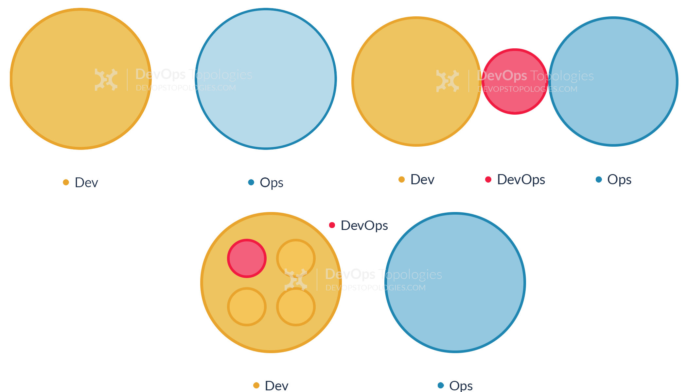
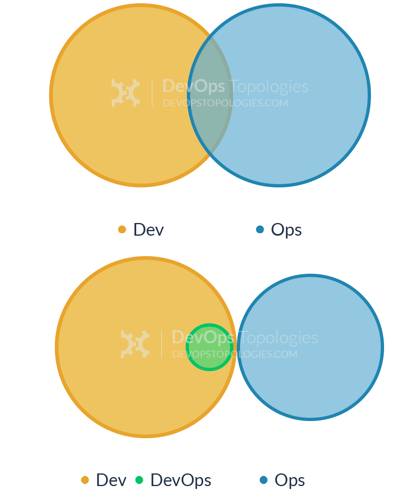

## Disclaimer {data-background-color="#FFA4A6"}

The views, thoughts, and opinions expressed in this presentation belong solely
to the author, and not necessarily to the author’s employer, organization,
committee or other group or individual.

# What's going on with the title?

## What is a paradox exactly?

> A paradox is a seemingly absurd or self-contradictory statement in logic that,
> superficially, cannot be true but also cannot be false.

ie: "This sentence is a lie."

## How about this other example?

> As Startup we **do** DevOps since we already have a team for that, regardless we don't know what they do.

<!-- Hint: You just created a new silo, which goes against DevOps. -->

# Thanks!

## Just kidding :)

## Taking this talk by the "book"

- **The Goal** - *Eliyahu M. Goldratt*
- **The Phoenix Project** - *Gene Kim, George Spafford, Kevin Behr*
- **Site Reliability Engineering** - *Betsy Beyer, Chris Jones, Jennifer Petoff, Niall Richard Murphy*
- **The Site Reliability Workbook** - *Betsy Beyer, Niall Richard Murphy, David K. Rensin, Kent Kawahara, Stephen Thorne*

# The Goal

## Have you asked yourself why are you on this company?

At the end it is all about delivering value! ($$$)

## Regardless the industry some facts stay true!

- Business and operations have been in a love/hate relationship for a long time
- It doesn't matter how much you optimize a process if you don't take in account your bottlenecks

# DevOps big picture

## As in "The Phoenix Project"

- **Dev** (Development) Needs to push its product changes as soon as possible
- **Ops** (Operations) Strives for stability

<!-- See also https://puppet.com/blog/what-is-devops -->

## The first way

Systems thinking and flow

## The second way

Amplify feedback loops

## The third way

Continual experimentation and learning **culture**

## Quick question

On those three graphs where is the **business deparment** and the **customers**?

# But I thought it was a job title

## It depends!

- It could be the pioneer team name that works toward implementing this cultural practice
- Some cloud providers use this term on their certifications. ei: [AWS Certified DevOps Engineer](https://aws.amazon.com/certification/certified-devops-engineer-professional/) and [Azure DevOps Engineer Expert](https://www.microsoft.com/en-us/learning/azure-devops.aspx)
<!--
Is not the same as the Linux Profissional Institute "DevOps Tools Engineer" 
https://www.lpi.org/our-certifications/devops-overview-->
- **Caution.** Nowadays companies use this term to broadly describe any professional that deals with infrastructure and automates.

## So... at the end is up to you :)

# Stop talking and show me the code!

## Site Reliability Engineering as a framework

> One could equivalently view SRE as a specific implementation of DevOps with
> some idiosyncratic extensions.

From Google's "Site Reliability Engineering" book

## So how?

- Foundations (SLO, Visility, Alerting, Automation)
- Practices (On call, Post Morten, Load management, Remove toil, Canary releases) <!-- SRE as job title -->
- Processes (Service lifecycle, SRE Team lifecycles)
- Organizational Changemanagement (error budgets)

# Where are we going? 

## DevOps Topoligies

<https://web.devopstopologies.com/>

## Where we have been

## How the future looks like

# Wrapping up

## My 2 cents

- DevOps is a cultural practice that involves best practices, automation and tools
- If you need a hard reference in DevOps, you can use Site Reliability Engineering as a framework
- It is quite difficult for a company to be 100% DevOps, because it requires to get **all the teams across the company** to be involved, but it's worth the effort!

## Questions?

